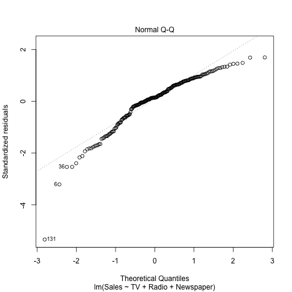
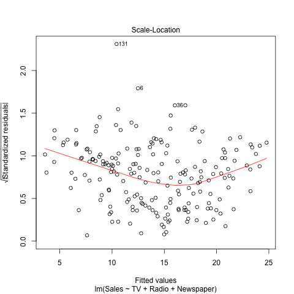

# Abstract

The idea of this project is to perform multiple least squares regression on the Advertising data set. This dataset reports 200 observations of `Sales`, `TV`, `Radio`, and `Newspaper`. This data is freely available ass a CSV file at [http://www-bcf.usc.edu/~gareth/ISL/Advertising.csv](http://www-bcf.usc.edu/~gareth/ISL/Advertising.csv). The methods discused are based on Chapter 3: Linear Regression (from " _An Introduction to Statistical Learning_" by James et al), which is available at http://www-bcf.usc.edu/~gareth/ISL/ISLR%20First%20Printing.pdf.


# Introduction

Given a data set containing information pertaining to advertising budgets for three different media (TV, Radio, and Newspaper), how can we model sales of a product?

To answer this question, this report will discuss multiple linear regression. We will attempt to model sales in thousands of dollars as a function of three variables: `TV`, `Radio` and `Newspaper`. Because we are modelling this relationship via linear regression, we are inherently assuming that a linear relationship exists between our dependent variables and independent variable. We will run this regression, and then comment on its validity.

# Data

The data set utilized in this paper, `Advertising.csv`, contains 200 observations of 5 variables. Each observation corresponds to one firm, and 4 of the variables are of interest: `Sales`, `Radio`, `TV` and `Newspaper`. The  variable `X` is an index.

This dataset is free to access online at the following url http://www-bcf.usc.edu/~gareth/ISL/Advertising.csv.

We will use all 4 variables of interest in this analysis. `Sales` refers to the sales of a particular product in thousands of dollars. `TV` refers to the firm's TV advertising budget in thousands of dollars. `Radio` refers to the firm's radio advertising mudget in thousands of dollars. `Newspaper` refers to the firm's newspaper advertising budget in thousands of dollars.

In our analysis, we will treat `Sales` as the dependent variable and the other 3 variables of interest as the independent variables.

# Methodology 

For this linear regression, we treat `Sales` as the response variable. This means `Sales` will depend on a function of some other variables. `TV`, `Newspaper` and `Radio` are the explanatory variables, meaning their values determine the value of `Sales` via a function. We use the simple linear model below to estimate the relationship between Sales and the three explanatory variables.

$$ Sales = \beta_0 + \beta_1*TV + \beta_2*Radio + \beta_3*Newspaper $$

We have 4 beta coefficients, 3 of which determine the slope and one (beta0) which is the intercept.

In order to fit a line to this data we must minimize the squared error. In other words we must find a line that minimizes the squared error, error being the distance between actual and fitted values. We accomplish this by minimizing the expression below.

$$\sum_{i=1}^n (y_i - \beta_0 - \beta_1x_1i - \beta_2x_2i - \beta_3x_3i)^2 $$

# Results

Performing ordinary least squares as described in the methodology section provides us with the following coefficients:

```{r}
library(xtable)
#read in data 
load(file="../data/regression.RData")
tbbl=xtable(advertising_lm$coefficients)
print(tbbl)       
```
Using the functions created in `code/functions/regression-functions.R` we get the following values for RSS, TSS, R^2, F-statistic, and RSE:

```{r}
source("../code/functions/regression-functions.R")

vec <- c(residual_sum_squares(advertising_lm), total_sum_squares (advertising_lm), r_squared(advertising_lm), f_statistic(advertising_lm), residual_std_error(advertising_lm))
names(vec) <- c("RSS", "TSS", "R2", "F-stat", "RSE")
tbbl=xtable(vec)
print(tbbl)
```

Here are some useful diagnostic plots for this regression as well:






# Conclusions
